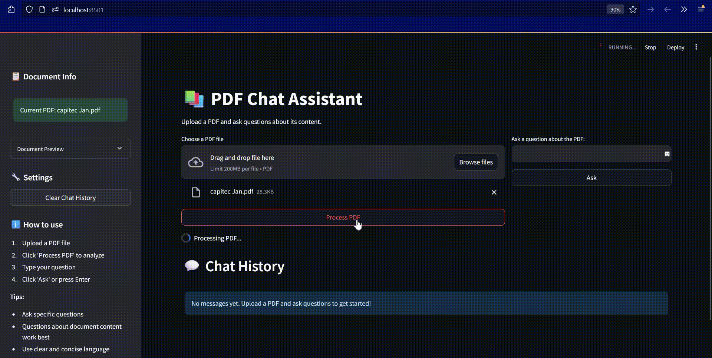

# PDF Chat Assistant 

A dynamic and intuitive PDF question-answering system leveraging Flask, Streamlit, and the Deepseek V3 API to create a seamless interactive chat interface for PDF documents.



---

## Features ✨

- **📄 PDF Text Extraction**: Effortlessly process and analyze PDF content.
- **💬 Interactive Chat Interface**: Engage with documents in a conversational manner.
- **🔍 Intelligent Q&A**: Powered by advanced AI for accurate responses.
- **📝 Chat History Tracking**: Keep a log of all interactions for future reference.
- **🎨 User-Friendly Interface**: Sleek, modern design for an excellent user experience.
- **📋 Document Preview**: View extracted text directly within the app.
- **⚡ Real-Time Responses**: Immediate answers to your queries.
- **🔄 Session Management**: Handle multiple sessions with ease.

---

## Prerequisites 

Ensure you have the following installed:
- Python 3.8 or higher
- pip (Python package manager)
- A Deepseek API key

---

## Installation 

1. **Clone the Repository**:
   ```bash
   git clone https://github.com/siyabongaprospersithole/rag-deepseekv3
   cd rag-deepseekv3
   ```

2. **Create and Activate a Virtual Environment**:
   - **Windows**:
     ```bash
     python -m venv venv
     .\venv\Scripts\activate
     ```
   - **Linux/Mac**:
     ```bash
     python3 -m venv venv
     source venv/bin/activate
     ```

3. **Install Dependencies**:
   ```bash
   pip install -r requirements.txt
   ```

   Create a `requirements.txt` file with the following dependencies:
   ```
   flask==2.0.1
   flask-cors==3.0.10
   streamlit==1.24.0
   PyPDF2==3.0.1
   python-dotenv==0.19.0
   requests==2.26.0
   openai==1.3.0
   ```

---

## Configuration 

1. Create a `.env` file with the following:
   ```env
   DEEPSEEK_API_TOKEN=your-deepseek-api-key-here
   FLASK_SECRET_KEY=your-secure-random-key-here
   ```

2. Replace `your-deepseek-api-key-here` with your actual Deepseek API key.

---

## Running the Application 

1. **Start the Flask Backend Server**:
   ```bash
   python python/rag.py
   ```

2. **Start the Streamlit Frontend**:
   In a new terminal:
   ```bash
   streamlit run python/streamlit_app.py
   ```

3. Open the application in your default browser at `http://localhost:8501`.

---

## Usage Guide 

1. **Upload a PDF**:
   - Click the "Browse files" button.
   - Select your PDF file.
   - Click "Process PDF."

2. **Ask Questions**:
   - Type your query in the input field.
   - Click "Ask" or press Enter.
   - View the response in the chat history.

3. **View Document Info**:
   - Access PDF information from the sidebar.
   - Expand "Document Preview" to view extracted text.

4. **Manage Chat History**:
   - Review all previous interactions.
   - Use "Clear Chat History" to reset the session.

---

## Project Structure 

```
pdf-chat-assistant/
├── python/
│   ├── rag.py             # Flask backend
│   └── streamlit_app.py   # Streamlit frontend
├── .env                   # Environment variables
├── requirements.txt       # Python dependencies
└── README.md              # Documentation
```

---

## Troubleshooting 🔧

### Common Issues:

1. **Connection Errors**:
   - Ensure both Flask and Streamlit servers are running.
   - Check if ports 5000 and 8501 are available.

2. **PDF Processing Errors**:
   - Ensure the PDF is text-based, not scanned.
   - Verify file permissions.

3. **API Key Issues**:
   - Confirm the API key in `.env` is correct.
   - Check API key permissions.

---

## Contributing 

We welcome contributions! Feel free to fork the repository, create a branch, and submit a Pull Request.

---

## License 

This project is licensed under the MIT License. See the `LICENSE` file for details.

---

## Acknowledgments 

- **Deepseek API** for its powerful language model.
- **Streamlit** for the incredible web framework.
- **Flask** for robust backend support.
